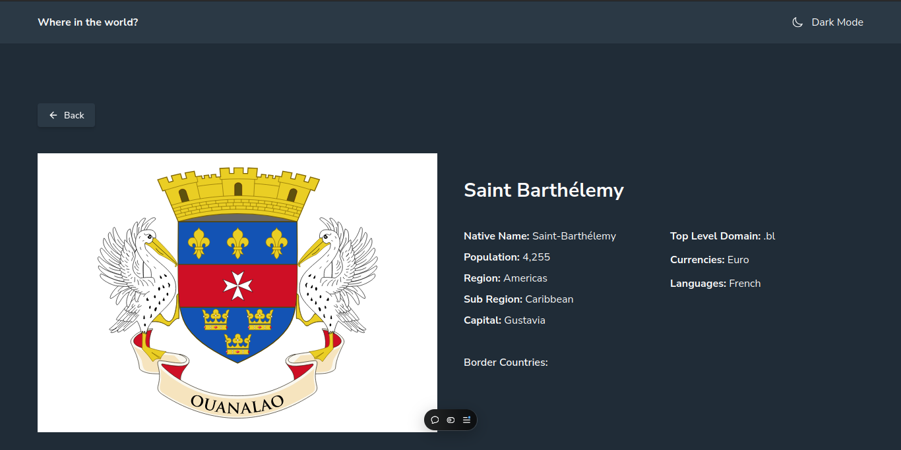
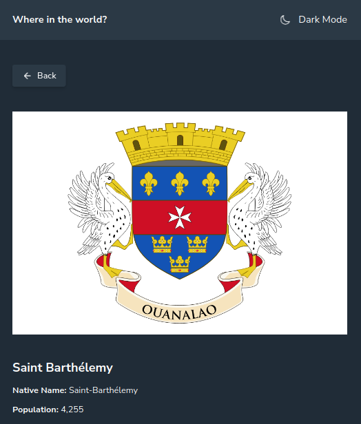
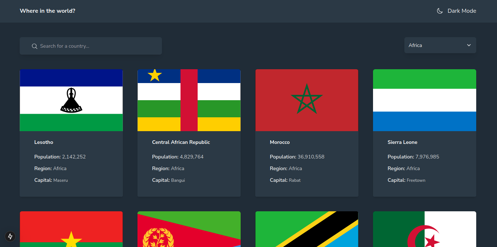
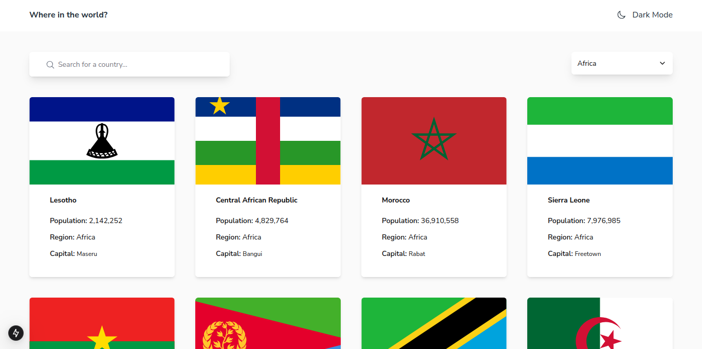
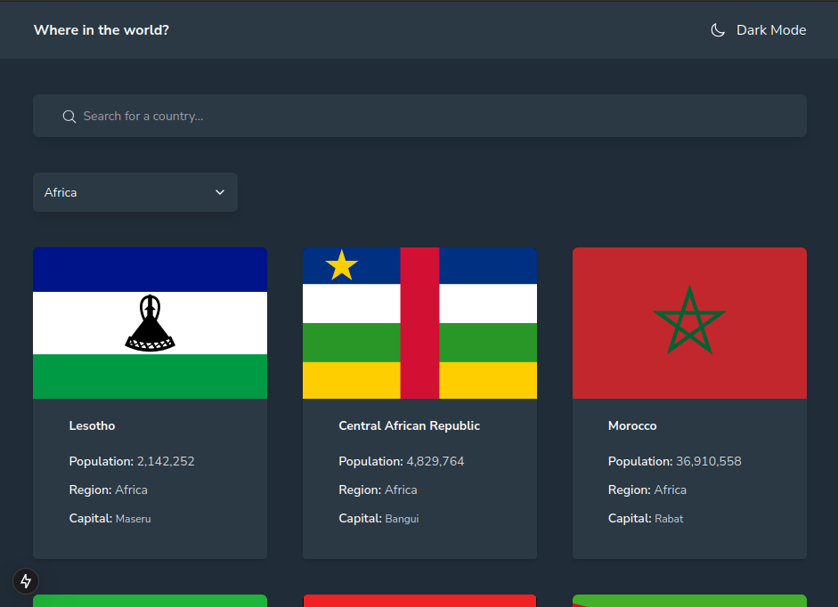

This is a solution to the [REST Countries API with color theme switcher challenge on Frontend Mentor](https://www.frontendmentor.io/challenges/rest-countries-api-with-color-theme-switcher-5cacc469fec04111f7b848ca). Frontend Mentor challenges help you improve your coding skills by building realistic projects.

## Table of contents

- [Overview](#overview)
  - [The challenge](#the-challenge)
  - [Screenshot](#screenshot)
  - [Links](#links)
- [My process](#my-process)
  - [Built with](#built-with)
  - [What I learned](#what-i-learned)
  - [Continued development](#continued-development)
  - [Useful resources](#useful-resources)
- [Author](#author)
- [Acknowledgments](#acknowledgments)

## Overview

Users should be able to:

- See all countries from the API on the homepage
- Search for a country using an `input` field
- Filter countries by region
- Click on a country to see more detailed information on a separate page
- Click through to the border countries on the detail page
- Toggle the color scheme between light and dark mode

### Screenshot

### Links

- Solution URL: [GitHub](https://github.com/KingHorey/countries-API)
- Live Site URL: [Vercel](https://countries-api-seven-neon.vercel.app/)

## My Process

I started out with mapping in my mind the various components for the page and what components would be client component or server components.

### Built with

- [Next.js](https://nextjs.org/) - React framework
- [Tailwind CSS](https://tailwindcss.com)
- [ShadCN](https://www.shadcn.com)
- [Lucide Icons](https://lucide.dev/icons)

### What I learned

SInce this was my frist project with the NextJS framework, I learned:

- Thinking about how to structure files, directories

- Splitting components into client and server types

- Code modularity

### Continued Development

Since API calls were made with Axios, the made is not a SSG page, further changes would focus on caching and also adding more visually appealing features like skeletons, not found page and Error pages

## Author

- GitHib - [kingHorey](https://www.github.com/kingHorey)
- X - [@kingHorey](https://www.x.com/kinghorey)
